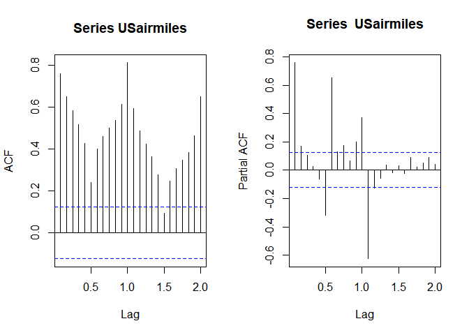

Predictive Analysis IV
================
Riki Herliansyah
13/10/2021

## One-shot experiment

This is one-shot experiment: it is the outcome produced by a single
simulated data set.

``` r
n <- 100
xbar <- mean(rnorm(n, mean=20, sd=5))
xbar
```

    ## [1] 21.01644

## Monte Carlo Simulation

``` r
set.seed(17)
R <- 1000
xbar <- numeric()
for (i in 1:R) {
  xbar[i] <- mean(rnorm(n, mean=20, sd=5))
}
mean(xbar)
```

    ## [1] 20.00486

``` r
hist(xbar, breaks=20)
abline(v=mean(xbar), col="red")
```

<!-- -->

The second simulation study where we have:

*Y*<sub>*t*</sub> = 0.5*Y*<sub>*t* − 1</sub> − 0.5*Z*<sub>*t* − 1</sub> + *Z*<sub>*t*</sub> − 0.6*X*<sub>*t*</sub>

where *δ* = 0.5, *θ* = 0.5, *β* =  − 0.6 and
*Z*<sub>*t*</sub> ∼ N(0, 1).

``` r
set.seed(17)
R <- 1000
deltahat <- numeric()
betahat <- numeric()
thetahat <- numeric()
for (i in 1:R) {
    Ut <- arima.sim(list(order=c(1,0,1), ar=0.5, ma=0.5), n=250)
    Xt <- rnorm(250, mean=10, sd=5)
    Yt <- Ut - 0.6*Xt
    fit <- arima(Yt, order = c(1,0,1), xreg = Xt, include.mean = FALSE)
    deltahat[i] <- fit$coef[1]
    thetahat[i] <- fit$coef[2]
    betahat[i] <- fit$coef[3]
}
mean(deltahat)
```

    ## [1] 0.4949172

``` r
mean(thetahat)
```

    ## [1] 0.5092242

``` r
mean(betahat)
```

    ## [1] -0.6000468

``` r
par(mfrow=c(1,3))
hist(deltahat, breaks=20)
abline(v=mean(deltahat), col="red")
hist(thetahat, breaks=20)
abline(v=mean(thetahat), col="red")
hist(betahat, breaks=20)
abline(v=mean(betahat), col="red")
```

<!-- -->

The following simulation study is to show how make predictions when
there exists explanatory variables. The model used is the same as the
previous model e.g.,
*Y*<sub>*t*</sub> = ARMA(1,1) + *β**X*<sub>*t*</sub>
. We split the data into training data set and testing data set for
assessing the forecasts.

``` r
set.seed(17)
Ut <- arima.sim(list(order=c(1,0,1), ar=0.5, ma=0.5), n=250)
Xt <- rnorm(250, mean=10, sd=5)
Yt <- Ut - 0.6*Xt
Ytrain <- Yt[1:200]
Xtrain <- Xt[1:200]
    
fit <- arima(Ytrain, order = c(1,0,1), xreg = Xtrain, method = "ML", include.mean = FALSE)
fit
```

    ## 
    ## Call:
    ## arima(x = Ytrain, order = c(1, 0, 1), xreg = Xtrain, include.mean = FALSE, method = "ML")
    ## 
    ## Coefficients:
    ##          ar1     ma1   Xtrain
    ##       0.6525  0.4418  -0.6139
    ## s.e.  0.0638  0.0785   0.0088
    ## 
    ## sigma^2 estimated as 1.146:  log likelihood = -298.05,  aic = 604.09

``` r
# the following to check if parameters are significant (TRUE is significant)
se.fit <- sqrt(diag(fit$var.coef)) 
abs(fit$coef[1]/se.fit[1]) > qnorm(0.975)
```

    ##  ar1 
    ## TRUE

``` r
abs(fit$coef[2]/se.fit[2]) > qnorm(0.975)
```

    ##  ma1 
    ## TRUE

``` r
abs(fit$coef[3]/se.fit[3]) > qnorm(0.975)
```

    ## Xtrain 
    ##   TRUE

The following is used to forecast 50 points ahead. We need to provide
extrapolation for *X*<sub>*t*</sub> for 50 points ahead as well,
however. In practice, we might need to extrapolate this by assuming 10%
increase for example (scenario and sensitivity analysis).

``` r
fit.fore <- predict(fit, newxreg=Xt[201:250], n.ahead=50)
ts.plot(as.ts(Yt), fit.fore$pred, col=c(1,2), lwd=c(1,2))
lines(fit.fore$pred + 1.96*fit.fore$se, col="blue", lty="dashed", lwd=1)
lines(fit.fore$pred - 1.96*fit.fore$se, col="blue", lty="dashed", lwd=1)
title("Forecasts")
legend("topleft",c( "Actual","Forecasts") , lty=c(1,1), lwd=c(2,2), col=c(1,2))
```

<!-- -->

## Intervention Modeling for US Passenger Airlines

Note: you should put the data along with the code in the same folder.

``` r
library(TSA)
```

    ## 
    ## Attaching package: 'TSA'

    ## The following objects are masked from 'package:stats':
    ## 
    ##     acf, arima

    ## The following object is masked from 'package:utils':
    ## 
    ##     tar

``` r
data<-read.csv("USAirTraffic2017.csv",header=F)
USairmiles<-ts(data[,2],start=c(1996,1),frequency=12)
ts.plot(USairmiles,xlim=c(1996,2018))
abline(v=2001+8/12,lwd=2,col="red")   # 9/11 attacks indicators to end of nearest month (August)
abline(v=2007+9/12,lwd=2,col="green")   # GFC = ASX peaked in September 2007?
legend("bottomright",legend=c("Terrorist Attacks","GFC"),lty=c(1,1),col=c("red","green"))
```

<!-- -->

The following is ACF and PACF of the data.

``` r
par(mfrow=c(1,2))
acf(USairmiles)
pacf(USairmiles)
```

<!-- -->

It seems that we need seasonally difference the data and then again
differencing at lag 1 non-seasonal component.

``` r
# Seasonally differenced data:
usair.d12<-diff(USairmiles,lag=12)
par(mfrow=c(1,3))
ts.plot(usair.d12)
abline(h=0)
acf(usair.d12)
pacf(usair.d12)
```

<!-- -->

``` r
# Differenced and Seasonally Differenced Data
usair.d1d12 <- diff(diff(USairmiles, lag=12))
par(mfrow=c(1,3))
ts.plot(usair.d1d12)
abline(h=0)
acf(usair.d1d12)
pacf(usair.d1d12)
```

<!-- -->

First, we will develop model using the airline model,
ARIMA(0,1,1)×(0,1,1)<sub>12</sub>.

``` r
# 36 month ahead Forecasting using seasonal ARIMA model based on data to August 2001.
USairmiles.pre<-window(USairmiles,end=c(2005,8))
air.m0<-arima(log(USairmiles.pre),order=c(0,1,1),
              seasonal=list(order=c(0,1,1),period=12),method='ML')
air.m0
```

    ## 
    ## Call:
    ## arima(x = log(USairmiles.pre), order = c(0, 1, 1), seasonal = list(order = c(0, 
    ##     1, 1), period = 12), method = "ML")
    ## 
    ## Coefficients:
    ##           ma1     sma1
    ##       -0.5257  -0.9995
    ## s.e.   0.0966   0.2866
    ## 
    ## sigma^2 estimated as 0.001873:  log likelihood = 163.59,  aic = -323.17

The next step is to check the residual plots.

``` r
par(mfrow=c(1,1))
tsdiag(air.m0,gof.lag=40) # use the inbuilt 'tsdiag' function.
```

<!-- -->

``` r
SWtest=shapiro.test(air.m0$residuals)
qqnorm(air.m0$residuals, main=paste("Normal Q-Q plot \n SW test P-val=", as.character(round(SWtest$p.value,4))))
```

<!-- -->

Finally, forecasting (even if we have a problem with non-normal
residuals).

``` r
air.m0.fore<-predict(air.m0,n.ahead=36)
ts.plot(log(USairmiles.pre),air.m0.fore$pred,col=c(1,4),lwd=c(1,2), ylim=c(17,18.2))
lines(air.m0.fore$pred+1.96*air.m0.fore$se,lty="dashed",col=2,lwd=1)
lines(air.m0.fore$pred-1.96*air.m0.fore$se,lty="dashed",col=2,lwd=1)
title("Log of US Airline PAX Miles Forecasts")
lines(window(log(USairmiles),start=c(2005,9),end=c(2008,8)),lwd=2)
legend("topleft",c("Forecasts", "Actual") , lty=c(1,1), lwd=c(2,2), col=c(4,1))
```

<!-- -->

Now, I am going to show how to return the log forecasts into original
values.

``` r
#mean forecast
air.m0.meanfore<-exp(air.m0.fore$pred+0.5*air.m0.fore$se^2)
upper.log.m0 <- air.m0.fore$pred+1.96*air.m0.fore$se
lower.log.m0 <- air.m0.fore$pred-1.96*air.m0.fore$se

ts.plot(USairmiles.pre,air.m0.meanfore, col=c(1,4),lwd=c(1,2),ylim=c(2.5*10^7,7.5*10^7))
lines(exp(upper.log.m0+0.5*air.m0.fore$se^2),lty="dashed",col=2,lwd=1)
lines(exp(lower.log.m0+0.5*air.m0.fore$se^2),lty="dashed",col=2,lwd=1)
title("US Airline PAX Miles Forecasts")
lines(window(USairmiles,start=c(2005,9),end=c(2008,8)),lwd=2)
legend("topleft",c("Forecasts", "Actual") , lty=c(1,1), lwd=c(2,2), col=c(4,1))
```

<!-- -->

``` r
#median forecast (remove hastag if you want to execute the code)
#air.m0.medfore<-exp(air.m0.fore$pred)
```

We are done with ARIMA model. Now, we are going to model the 9/11
attacks first as we show in the slide, that is we introduce an
instantaneous major impact term based on a pulse and a decay term which
eventually reduces to zero impact after an exponential decay.

$$ I\_t = \\omega\_0 P\_t (T) + \\frac{\\omega\_1}{1-\\delta B} P\_t (T)$$

So, our model becomes:

*Y*<sub>*t*</sub> = *I*<sub>*t*</sub> + *U*<sub>*t*</sub>

where *U*<sub>*t*</sub> = arima(0, 1, 1) × (0, 1, 1)<sub>12</sub>, the
airline model, T= September 2001 and 𝐵 = backshift operator.

``` r
# we create the pulse variable to model the short-term impact of 9/11 attacks
Nine11p=1*(seq(USairmiles.pre)==69) # pulse function at September 2001

air.all.m=arimax(log(USairmiles.pre),order=c(0,1,1),
                 seasonal=list(order=c(0,1,1), period=12),
                 xtransf=data.frame(Nine11p,Nine11p),
                 transfer=list(c(0,0),c(1,0)),method='ML')

air.all.m
```

    ## 
    ## Call:
    ## arimax(x = log(USairmiles.pre), order = c(0, 1, 1), seasonal = list(order = c(0, 
    ##     1, 1), period = 12), method = "ML", xtransf = data.frame(Nine11p, Nine11p), 
    ##     transfer = list(c(0, 0), c(1, 0)))
    ## 
    ## Coefficients:
    ##           ma1     sma1  Nine11p-MA0  Nine11p.1-AR1  Nine11p.1-MA0
    ##       -0.6701  -0.7182      -0.1623         0.9350        -0.2118
    ## s.e.   0.0914   0.1469       0.0335         0.0392         0.0267
    ## 
    ## sigma^2 estimated as 0.0006186:  log likelihood = 229.69,  aic = -449.39

As usual, we will check residual plot.

``` r
par(mfrow=c(2,2))
plot(log(USairmiles.pre),ylab="log(airmiles)")
points(fitted(air.all.m))
abline(v=2001+9/12,lwd=2,col=3)    # 911 attacks
plot(air.all.m$residuals, type="h")
abline(v=2001+9/12,lwd=2,col=3)    # 911 attacks

acf(air.all.m$residuals)
SWtest=shapiro.test(air.all.m$residuals)
qqnorm(air.all.m$residuals, main=paste("Normal Q-Q plot \n SW test P-val=", as.character(round(SWtest$p.value,4))))
```

<!-- -->

The fitted intervention effect from the above model.

``` r
omega_0=air.all.m$coef["Nine11p-MA0"]
omega_1=air.all.m$coef["Nine11p.1-MA0"]
delta=air.all.m$coef["Nine11p.1-AR1"]

AttackImpact<-ts(omega_0*Nine11p+omega_1*filter(Nine11p,filter=delta,method='recursive',side=1),
                 frequency =12, start=1996)
par(mfrow=c(1,1))
plot(AttackImpact,ylab='9/11 Impact', type='h'); abline(h=0)
```

<!-- -->

Next, we will add a long-term effect:

$$ I\_t = \\omega\_0 P\_t (T) + \\frac{\\omega\_1}{1-\\delta B} P\_t (T) + \\omega\_2 S\_t(T)$$

After running the model, you will find that *ω*<sub>0</sub> is not
significant (try this out yourself). Since $\_0 is not significant, so
our model becomes:

$$ Y\_t = \\frac{\\omega\_1}{1-\\delta B} P\_t (T) + \\omega\_2 S\_t(T) + U\_t + O\_t$$

where *𝑈*<sub>*𝑡*</sub>=arima(0,1,1)×(0,1,1)<sub>12</sub>, the airline
model. An outlier (𝑂\_𝑡) is also detected and modelled.

``` r
Nine11s<-c(rep(0,68),rep(1,length(Nine11p)-68))  # Step Function at September 2001

air.m2=arimax(log(USairmiles.pre),order=c(0,1,1),
              seasonal=list(order=c(0,1,1), period=12),
              xtransf=data.frame(Nine11p,Nine11p, Nine11s),
              transfer=list(c(0,0),c(1,0),c(0,0)),method='ML')

air.m2
```

    ## 
    ## Call:
    ## arimax(x = log(USairmiles.pre), order = c(0, 1, 1), seasonal = list(order = c(0, 
    ##     1, 1), period = 12), method = "ML", xtransf = data.frame(Nine11p, Nine11p, 
    ##     Nine11s), transfer = list(c(0, 0), c(1, 0), c(0, 0)))
    ## 
    ## Coefficients:
    ##           ma1     sma1  Nine11p-MA0  Nine11p.1-AR1  Nine11p.1-MA0  Nine11s-MA0
    ##       -0.7106  -0.6493      -0.0705         0.6201        -0.1866      -0.1230
    ## s.e.   0.0669   0.1438       0.0543         0.1234         0.0501       0.0256
    ## 
    ## sigma^2 estimated as 0.0005809:  log likelihood = 233.93,  aic = -455.86

``` r
par(mfrow=c(2,2))
plot(log(USairmiles.pre),ylab="log(airmiles)")
points(fitted(air.m2))
plot(air.m2$residuals, type="h")
SWtest=shapiro.test(air.m2$residuals)
qqnorm(air.m2$residuals, main=paste("Normal Q-Q plot \n SW test P-val=", as.character(round(SWtest$p.value,4))))
```

<!-- -->

After checking the residual plot, we found an outlier and add an outlier
dummy for the single positive outlier.

``` r
#locating the positive outlier and defining a dummy variable for it
ndata=length(air.m2$residuals)
out=rep(0,ndata)
out[air.m2$residuals==max(air.m2$residuals)]=1
```

Fitting the model again with the inclusion an outlier dummy.

``` r
air.m3=arimax(log(USairmiles.pre),order=c(0,1,1),
              seasonal=list(order=c(0,1,1),period=12),
              xtransf=data.frame(Nine11p, Nine11s,out),
              transfer=list(  c(1,0),   c(0,0),   c(0,0)),method='ML')
air.m3
```

    ## 
    ## Call:
    ## arimax(x = log(USairmiles.pre), order = c(0, 1, 1), seasonal = list(order = c(0, 
    ##     1, 1), period = 12), method = "ML", xtransf = data.frame(Nine11p, Nine11s, 
    ##     out), transfer = list(c(1, 0), c(0, 0), c(0, 0)))
    ## 
    ## Coefficients:
    ##           ma1     sma1  Nine11p-AR1  Nine11p-MA0  Nine11s-MA0  out-MA0
    ##       -0.6637  -0.5378       0.4740      -0.2466      -0.1292   0.0787
    ## s.e.   0.0700   0.1494       0.0795       0.0238       0.0231   0.0184
    ## 
    ## sigma^2 estimated as 0.000516:  log likelihood = 241.33,  aic = -470.66

``` r
par(mfrow=c(2,2))
plot(log(USairmiles.pre),ylab="log(airmiles)")
points(fitted(air.m3))
plot(air.m3$residuals, type="h")
acf(air.m3$residuals)
SWtest=shapiro.test(air.m3$residuals)
qqnorm(air.m3$residuals, main=paste("Normal Q-Q plot \n SW test P-val=", as.character(round(SWtest$p.value,4))))
```

<!-- -->

We will now draw the plot to see the impact of 9/11 atacks both a
short-term and a long-term effect.

``` r
omega_1=air.m3$coef["Nine11p-MA0"]
delta=air.m3$coef["Nine11p-AR1"]
omega_2=air.m3$coef["Nine11s-MA0"]

InterventionImpacts<-ts(omega_2*Nine11s
                        +omega_1*filter(Nine11p,filter=delta,method='recursive',side=1),
                        frequency =12, start=1996)
par(mfrow=c(1,1))
plot(InterventionImpacts,ylab='Impact', type='h'); abline(h=0)
```

<!-- -->

Next, I want to show how we make future predictions using intervention
modeling.

``` r
# First, we need to define the regressor (explanatory variables)

Nine11p<-1*(seq(USairmiles.pre)==69) # pulse function at September 2011
Nine11Decay<-c(rep(0,68),delta^(0:(length(Nine11p)-69)))  # delta from Intervention Model air.m3
Nine11step<-c(rep(0,68),rep(1,length(Nine11p)-68))

#this is the effects that we are trying to include
par(mfrow=c(1,3))
ts.plot(Nine11step, col="blue", ylab="St(T)")
abline(v=69)
ts.plot(Nine11Decay, col="blue", ylab="Pt*(T)")
abline(v=69)
ts.plot(out, col="blue", ylab="Ot(T)")
abline(v=which.max(out))
```

<!-- -->

``` r
#we combine them together
X=model.matrix(USairmiles.pre~ -1+   # -1 ensures no intercept is included
                 Nine11step+Nine11Decay+out)

N=length(log(USairmiles.pre))
L<-36 #(number of future predictions)
newNine11step<-rep(1,L)  # permanent change stays at 1.
newDecaynine11<-delta^(N+1:L-69)  # Effectively zero but put here to show general idea
outL <- rep(0,L)
#this is new values for our explanatory variables for 36 months ahead.
newxreg<-cbind(newNine11step,newDecaynine11,outL)
colnames(newxreg)<-colnames(X)
```

Let’s make forecasts.

``` r
model9.6.fixDecay<-arima(log(USairmiles.pre),order=c(0,1,1),xreg=X,
                         seasonal=list(order=c(1,1,1),period=12),method="ML")

model9.6.fixDecay   # almost identical (rounding) to results (point estimates and SE's)
```

    ## 
    ## Call:
    ## arima(x = log(USairmiles.pre), order = c(0, 1, 1), seasonal = list(order = c(1, 
    ##     1, 1), period = 12), xreg = X, method = "ML")
    ## 
    ## Coefficients:
    ##           ma1    sar1     sma1  Nine11step  Nine11Decay     out
    ##       -0.6546  0.3601  -0.9298     -0.1194      -0.2528  0.0751
    ## s.e.   0.0701  0.1728   0.3936      0.0194       0.0230  0.0181
    ## 
    ## sigma^2 estimated as 0.0004583:  log likelihood = 242.99,  aic = -473.97

``` r
#the following is the forecasts
model9.6.fixDecay.fore<-predict(model9.6.fixDecay,newxreg=newxreg,n.ahead=L)

#always check the residuals if we are happy with it
par(mfrow=c(2,2))
plot(log(USairmiles.pre),ylab="log(airmiles)")
points(fitted(model9.6.fixDecay))
plot(model9.6.fixDecay$residuals, type="h")
acf(model9.6.fixDecay$residuals)
SWtest=shapiro.test(model9.6.fixDecay$residuals)
qqnorm(model9.6.fixDecay$residuals, main=paste("Normal Q-Q plot \n SW test P-val=", as.character(round(SWtest$p.value,4))))
```

<!-- -->

Finally, visualise them.

``` r
#mean forecast
model9.meanfore<-exp(model9.6.fixDecay.fore$pred+0.5*air.m0.fore$se^2)
upper.log <- model9.6.fixDecay.fore$pred+1.96*model9.6.fixDecay.fore$se
lower.log <- model9.6.fixDecay.fore$pred-1.96*model9.6.fixDecay.fore$se

par(mfrow=c(1,1))
ts.plot(log(USairmiles.pre), model9.6.fixDecay.fore$pred, air.m0.fore$pred, col=c(1,2,3),lwd=c(1,2), ylim=c(17,18.2))
lines(model9.6.fixDecay.fore$pred+1.96*model9.6.fixDecay.fore$se,lty="dashed",col=2,lwd=1)
lines(model9.6.fixDecay.fore$pred-1.96*model9.6.fixDecay.fore$se,lty="dashed",col=2,lwd=1)
lines(air.m0.fore$pred+1.96*air.m0.fore$se,lty="dashed",col=3,lwd=1)
lines(air.m0.fore$pred-1.96*air.m0.fore$se,lty="dashed",col=3,lwd=1)
title("US Airline PAX Miles Forecasts")
lines(window(log(USairmiles),start=c(2005,9),end=c(2008,8)),lwd=2)
legend("topleft",c( "Actual","Forecasts:IM","Forecasts:ARIMA") , lty=c(1,1), lwd=c(2,2), col=c(1,2,3))
```

<!-- -->

This is the origin values.

``` r
par(mfrow=c(1,1))
ts.plot(USairmiles.pre, model9.meanfore, air.m0.meanfore, col=c(1,2,3),lwd=c(1,2), ylim=c(2.5*10^7,7.5*10^7))
lines(exp(upper.log+0.5*model9.6.fixDecay.fore$se^2),lty="dashed",col=2,lwd=1)
lines(exp(lower.log+0.5*model9.6.fixDecay.fore$se^2),lty="dashed",col=2,lwd=1)
lines(exp(upper.log.m0+0.5*air.m0.fore$se^2),lty="dashed",col=3,lwd=1)
lines(exp(lower.log.m0+0.5*air.m0.fore$se^2),lty="dashed",col=3,lwd=1)
title("US Airline PAX Miles Forecasts")
lines(window(USairmiles,start=c(2005,9),end=c(2008,8)),lwd=2)
legend("topleft",c( "Actual","Forecasts:IM","Forecasts:ARIMA") , lty=c(1,1), lwd=c(2,2), col=c(1,2,3))
```

<!-- -->

Now, we are going to combine both impacts into the model, 9/11 attacks
and the 2008 GFC. First, we need to create the pulse (short-term) and
the step (long-term) indicator variables for both impacts.

``` r
# 9/11 attacks
airmiles.all<-window(USairmiles,end=c(2014,12))
Nine11p=1*(seq(airmiles.all)==69) # pulse function at September 2001
Nine11s=c(rep(0,68),rep(1,length(Nine11p)-68))  # Step Function at September 2001#

# GFC
GFCp=1*(seq(airmiles.all)==153) # pulse function at September 2008
GFCs=c(rep(0,153),rep(1,length(GFCp)-153))  # Step Function at September 2008
```

Next is to develop the model.

``` r
air.all=arimax(log(airmiles.all),order=c(0,1,1),
                               seasonal=list(order=c(0,1,2), period=12),
                               xtransf=data.frame(Nine11p, Nine11s,GFCp,GFCs),
                               transfer=list(c(1,0),c(0,0),c(1,0),c(0,0)),method='ML')

air.all
```

    ## 
    ## Call:
    ## arimax(x = log(airmiles.all), order = c(0, 1, 1), seasonal = list(order = c(0, 
    ##     1, 2), period = 12), method = "ML", xtransf = data.frame(Nine11p, Nine11s, 
    ##     GFCp, GFCs), transfer = list(c(1, 0), c(0, 0), c(1, 0), c(0, 0)))
    ## 
    ## Coefficients:
    ##           ma1     sma1     sma2  Nine11p-AR1  Nine11p-MA0  Nine11s-MA0
    ##       -0.6304  -0.5824  -0.1756       0.5201      -0.2594      -0.1130
    ## s.e.   0.0533   0.0727   0.0667       0.0800       0.0249       0.0261
    ##       GFCp-AR1  GFCp-MA0  GFCs-MA0
    ##        -0.6002   -0.0628   -0.0827
    ## s.e.    0.1636    0.0192    0.0180
    ## 
    ## sigma^2 estimated as 0.0004426:  log likelihood = 520.36,  aic = -1022.72

``` r
#remove outlier
ndata=length(air.all$residuals)
out.all=rep(0,ndata)
out.all[air.all$residuals==max(air.all$residuals)]=1

#remodel the data with ourlier now
air.all.m.maGFCresponse=arimax(log(airmiles.all),order=c(0,1,1),
                               seasonal=list(order=c(0,1,2), period=12),
                               xtransf=data.frame(Nine11p, Nine11s,GFCp,GFCs,out.all),
                               transfer=list(c(1,0),c(0,0),c(1,0),c(0,0),c(0,0)),method='ML')

air.all.m.maGFCresponse
```

    ## 
    ## Call:
    ## arimax(x = log(airmiles.all), order = c(0, 1, 1), seasonal = list(order = c(0, 
    ##     1, 2), period = 12), method = "ML", xtransf = data.frame(Nine11p, Nine11s, 
    ##     GFCp, GFCs, out.all), transfer = list(c(1, 0), c(0, 0), c(1, 0), c(0, 0), 
    ##     c(0, 0)))
    ## 
    ## Coefficients:
    ##           ma1     sma1     sma2  Nine11p-AR1  Nine11p-MA0  Nine11s-MA0
    ##       -0.6054  -0.5536  -0.1610       0.4912      -0.2599      -0.1147
    ## s.e.   0.0522   0.0725   0.0677       0.0740       0.0238       0.0247
    ##       GFCp-AR1  GFCp-MA0  GFCs-MA0  out.all-MA0
    ##        -0.6270   -0.0605   -0.0804       0.0762
    ## s.e.    0.1445    0.0177    0.0176       0.0164
    ## 
    ## sigma^2 estimated as 0.0004058:  log likelihood = 530.49,  aic = -1040.97

Draw the effects as we did before.

``` r
names(air.all.m.maGFCresponse$coef)
```

    ##  [1] "ma1"         "sma1"        "sma2"        "Nine11p-AR1" "Nine11p-MA0"
    ##  [6] "Nine11s-MA0" "GFCp-AR1"    "GFCp-MA0"    "GFCs-MA0"    "out.all-MA0"

``` r
omega_1=air.all.m.maGFCresponse$coef["Nine11p-MA0"]
delta=air.all.m.maGFCresponse$coef["Nine11p-AR1"]
omega_2=air.all.m.maGFCresponse$coef["Nine11s-MA0"]

omega_1.dash=air.all.m.maGFCresponse$coef["GFCp-MA0"]
delta.dash=air.all.m.maGFCresponse$coef["GFCp-AR1"]
omega_2.dash=air.all.m.maGFCresponse$coef["GFCs-MA0"]

InterventionImpacts<-ts(omega_2*Nine11s
                        +omega_1*filter(Nine11p,filter=delta,method='recursive',side=1)
                        +omega_1.dash*filter(GFCp,filter=delta.dash,method='recursive',side=1)
                        +omega_2.dash*GFCs,
                        frequency =12, start=1996)
par(mfrow=c(1,1))
plot(InterventionImpacts,ylab='Impact', type='h'); abline(h=0)
```

<!-- -->

Check the residuals and we are happy with the plots :).

``` r
par(mfrow=c(2,2))
plot(log(airmiles.all),ylab="log(airmiles)")
points(fitted(air.all.m.maGFCresponse))
plot(air.all.m.maGFCresponse$residuals, type="h")
acf(air.all.m.maGFCresponse$residuals)
SWtest=shapiro.test(air.all.m.maGFCresponse$residuals)
qqnorm(air.all.m.maGFCresponse$residuals, main=paste("Normal Q-Q plot \n SW test P-val=", as.character(round(SWtest$p.value,4))))
```

<!-- -->

Finally, forecasts and visualisation following the previous steps.

``` r
Nine11p<-1*(seq(airmiles.all)==69) # pulse function at September 2011
Nine11Decay<-c(rep(0,68),delta^(0:(length(Nine11p)-69)))  # delta from Intervention Model air.m3
Nine11step<-c(rep(0,68),rep(1,length(Nine11p)-68))

# GFC
GFCp=1*(seq(airmiles.all)==153) # pulse function at September 2008
GFCpdecay=c(rep(0,152),delta.dash^(0:(length(GFCp)-153))) # pulse function at September 2008
GFCs=c(rep(0,153),rep(1,length(GFCp)-153))  # Step Function at September 2008

X=model.matrix(airmiles.all~ -1+   # -1 ensures no intercept is included
                 Nine11step + Nine11Decay +
                 GFCs + GFCpdecay + out.all)

N=length(log(airmiles.all))
# Get actual values from from start t=1 to t= N+L 
L<-36
newNine11step<-rep(1,L)  # permanent change stays at 1.
newDecaynine11<-delta^(N+1:L-69)  # Effectively zero but put here to show general idea
newDecayGFC <- delta.dash^(N+1:L-153)
outL <- rep(0,L)

newxreg<-cbind(newNine11step,newDecaynine11,newNine11step,newDecayGFC,outL)
colnames(newxreg)<-colnames(X)

model9.6.fixDecay<-arima(log(airmiles.all),order=c(0,1,1),xreg=X,
                         seasonal=list(order=c(0,1,2),period=12),method="ML")

model9.6.fixDecay   # almost identical (rounding) to results (point estimates and SE's)
```

    ## 
    ## Call:
    ## arima(x = log(airmiles.all), order = c(0, 1, 1), seasonal = list(order = c(0, 
    ##     1, 2), period = 12), xreg = X, method = "ML")
    ## 
    ## Coefficients:
    ##           ma1     sma1     sma2  Nine11step  Nine11Decay     GFCs  GFCpdecay
    ##       -0.6054  -0.5533  -0.1607     -0.1148      -0.2598  -0.0804    -0.0605
    ## s.e.   0.0515   0.0718   0.0667      0.0194       0.0220   0.0168     0.0133
    ##       out.all
    ##        0.0762
    ## s.e.   0.0163
    ## 
    ## sigma^2 estimated as 0.0004059:  log likelihood = 530.49,  aic = -1044.97

``` r
model9.6.fixDecay.fore<-predict(model9.6.fixDecay,newxreg=newxreg,n.ahead=L)
par(mfrow=c(2,2))
plot(log(airmiles.all),ylab="log(airmiles)")
points(fitted(model9.6.fixDecay))
plot(air.m3$residuals, type="h")
acf(model9.6.fixDecay$residuals)
SWtest=shapiro.test(model9.6.fixDecay$residuals)
qqnorm(model9.6.fixDecay$residuals, main=paste("Normal Q-Q plot \n SW test P-val=", as.character(round(SWtest$p.value,4))))
```

<!-- -->

``` r
#for comparison, we fit the airline model only
air.m0<-arima(log(airmiles.all),order=c(0,1,1),
              seasonal=list(order=c(0,1,2),period=12),method='ML')
air.m0
```

    ## 
    ## Call:
    ## arima(x = log(airmiles.all), order = c(0, 1, 1), seasonal = list(order = c(0, 
    ##     1, 2), period = 12), method = "ML")
    ## 
    ## Coefficients:
    ##           ma1     sma1     sma2
    ##       -0.5171  -0.7286  -0.1445
    ## s.e.   0.0614   0.0764   0.0703
    ## 
    ## sigma^2 estimated as 0.001275:  log likelihood = 403.29,  aic = -800.57

``` r
par(mfrow=c(1,1))
tsdiag(air.m0,gof.lag=40) # use the inbuilt 'tsdiag' function.
```

<!-- -->

``` r
#title("Residual Diagnostics for ARIMA(0,1,1)x(0,1,1)12 model for US passenger miles",outer=TRUE)
SWtest=shapiro.test(air.m0$residuals)
qqnorm(air.m0$residuals, main=paste("Normal Q-Q plot \n SW test P-val=", as.character(round(SWtest$p.value,4))))
```

<!-- -->

``` r
air.m0.fore<-predict(air.m0,n.ahead=36)
par(mfrow=c(1,1))
ts.plot(log(airmiles.all),model9.6.fixDecay.fore$pred, air.m0.fore$pred, col=c(1,2,3),lwd=c(1,2), ylim=c(17.1,18.2))
lines(model9.6.fixDecay.fore$pred+1.96*model9.6.fixDecay.fore$se,lty="dashed",col=2,lwd=1)
lines(model9.6.fixDecay.fore$pred-1.96*model9.6.fixDecay.fore$se,lty="dashed",col=2,lwd=1)
lines(air.m0.fore$pred+1.96*air.m0.fore$se,lty="dashed",col=3,lwd=1)
lines(air.m0.fore$pred-1.96*air.m0.fore$se,lty="dashed",col=3,lwd=1)
title("US Airline PAX Miles Forecasts")
lines(window(log(USairmiles),start=c(2015,1),end=c(2017,1)),lwd=1)
legend("topleft",c( "Actual","Forecasts:IM","Forecasts:ARIMA") , lty=c(1,1), lwd=c(2,2), col=c(1,2,3))
```

<!-- -->

This is the origin values.

``` r
#mean forecast
model9.meanfore<-exp(model9.6.fixDecay.fore$pred+0.5*air.m0.fore$se^2)
upper.log <- model9.6.fixDecay.fore$pred+1.96*model9.6.fixDecay.fore$se
lower.log <- model9.6.fixDecay.fore$pred-1.96*model9.6.fixDecay.fore$se

air.m0.meanfore<-exp(air.m0.fore$pred+0.5*air.m0.fore$se^2)
upper.log.m0 <- air.m0.fore$pred+1.96*air.m0.fore$se
lower.log.m0 <- air.m0.fore$pred-1.96*air.m0.fore$se

par(mfrow=c(1,1))
ts.plot(airmiles.all, model9.meanfore, air.m0.meanfore, col=c(1,2,3),lwd=c(1,2), ylim=c(2.5*10^7,7.5*10^7))
lines(exp(upper.log+0.5*model9.6.fixDecay.fore$se^2),lty="dashed",col=2,lwd=1)
lines(exp(lower.log+0.5*model9.6.fixDecay.fore$se^2),lty="dashed",col=2,lwd=1)
lines(exp(upper.log.m0+0.5*air.m0.fore$se^2),lty="dashed",col=3,lwd=1)
lines(exp(lower.log.m0+0.5*air.m0.fore$se^2),lty="dashed",col=3,lwd=1)
title("US Airline PAX Miles Forecasts")
lines(window(USairmiles,start=c(2015,1),end=c(2017,1)),lwd=1)
legend("topleft",c( "Actual","Forecasts:IM","Forecasts:ARIMA") , lty=c(1,1), lwd=c(2,2), col=c(1,2,3))
```

<!-- -->
